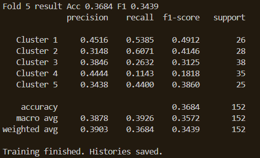
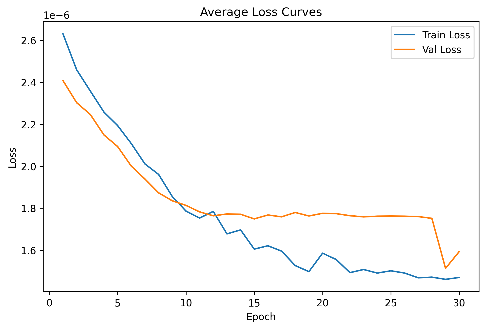

# Evaluasi Model Multimodal Audio, Lyrics, MIDI

## Deskripsi Singkat
Dokumen ini berisi ringkasan hasil pelatihan dan evaluasi model multimodal menggunakan 5-Fold Cross Validation. Semua hasil visual otomatis dihasilkan oleh program dan disimpan dalam folder `visualitation`.

## Hasil Evaluasi

### 1. Classification Report Fold 1

Menampilkan precision, recall, dan f1-score untuk setiap cluster pada Fold 1.

### 2. Classification Report Fold 2

Evaluasi performa model pada Fold 2.

### 3. Classification Report Fold 3

Evaluasi performa model pada Fold 3.

### 4. Classification Report Fold 4

Evaluasi performa model pada Fold 4.

### 5. Classification Report Fold 5

Evaluasi performa model pada Fold 5.

### 6. Classification Report Keseluruhan

Agregasi seluruh fold. Digunakan sebagai metrik utama performa model.

### 7. Confusion Matrix Rata-rata

Menunjukkan distribusi prediksi dan kesalahan klasifikasi antar cluster.

### 8. Learning Curve Accuracy

Perubahan akurasi train dan validasi sepanjang epoch.

### 9. Learning Curve Loss

Perubahan nilai loss train dan validasi sepanjang epoch.

### 10. Distribusi MAE

Distribusi Mean Absolute Error dari hasil prediksi model.

### 11. Ringkasan Numerik Evaluasi
File CSV: `visualitation/enhanced_multimodal_results.csv`
Berisi akurasi, F1-score, dan MAE untuk setiap fold.

## Penjelasan Model

Model yang digunakan merupakan model klasifikasi multimodal yang menggabungkan tiga sumber data utama: **audio**, **lirik**, dan **MIDI**.

### 1. Modalitas Audio
Audio diproses menggunakan **PANN CNN14** sebagai feature extractor. Model CNN14 dimuat dari checkpoint pretrained lokal `Cnn14_mAP=0.431.pth`. Model ini mengekstraksi representasi audio berdimensi tinggi dari sinyal waveform. Bobot PANN tidak dilatih ulang dan digunakan sebagai ekstraktor fitur tetap.

### 2. Modalitas Lirik
Lirik diproses menggunakan model **BERT pretrained**. Teks lirik di-tokenisasi lalu dimasukkan ke BERT untuk menghasilkan embedding semantik yang merepresentasikan konteks dan makna lirik secara menyeluruh.

### 3. Modalitas MIDI
File MIDI diproses menggunakan library `pretty_midi`. Informasi musikal seperti pitch, timing, dan velocity diekstraksi menjadi fitur numerik yang merepresentasikan struktur musik.

### 4. Fusi Multimodal
Fitur dari audio, lirik, dan MIDI digabungkan menggunakan metode **concatenation**. Hasil penggabungan menjadi satu vektor fitur multimodal yang kemudian dimasukkan ke classifier berbasis neural network.

### 5. Proses Pelatihan
Pelatihan dilakukan menggunakan skema **5-Fold Cross Validation**. Pada setiap fold, data dibagi menjadi data latih dan validasi. Early stopping diterapkan berdasarkan nilai F1-score validasi.

### 6. Evaluasi Model
Evaluasi dilakukan menggunakan beberapa metrik:
- **Accuracy**: mengukur ketepatan klasifikasi
- **F1-score**: menilai keseimbangan precision dan recall
- **Confusion matrix**: analisis kesalahan klasifikasi
- **MAE**: mengukur kesalahan prediksi label secara numerik

## Jumlah Data yang Diproses

**Total lagu: 764 lagu**

### Penjelasan Jumlah Data:
- Dataset audio tersedia: **903 file**
- Dataset lirik tersedia: **764 file**
- Dataset MIDI: jumlah terbatas (fitur tambahan)

### Aturan Seleksi Data:
- Lagu dipertahankan jika memiliki pasangan audio dan lirik
- Lagu tanpa lirik dikeluarkan dari proses
- MIDI diperlakukan sebagai fitur tambahan dengan nilai default jika tidak tersedia

Pendekatan ini dipilih agar jumlah data tetap maksimal dan informasi audio-teks tetap menjadi sumber utama pembelajaran, tanpa mengorbankan sampel pelatihan akibat keterbatasan file MIDI.

## Catatan Eksekusi

- Semua gambar disimpan dalam format PNG
- Semua nilai diperoleh dari eksekusi langsung tanpa modifikasi manual
- Model menggunakan BERT untuk lirik, PANN CNN14 untuk audio, dan fitur MIDI
- Training selesai tanpa error
- Semua visualisasi berhasil disimpan di folder `visualitation/`

## Status
**Training selesai** - Semua visualisasi siap digunakan untuk analisis dan pelaporan.